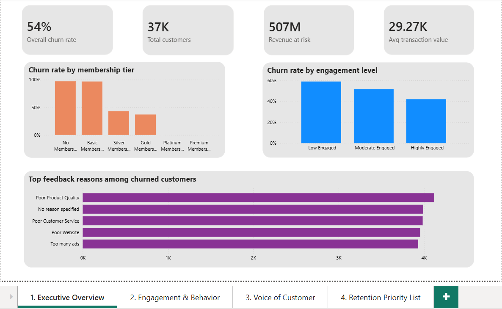
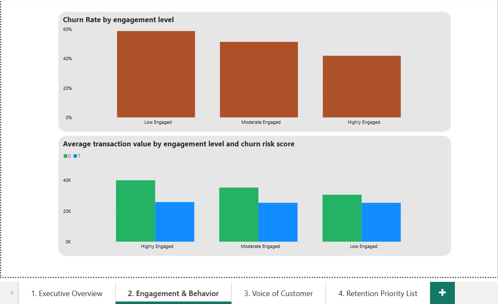
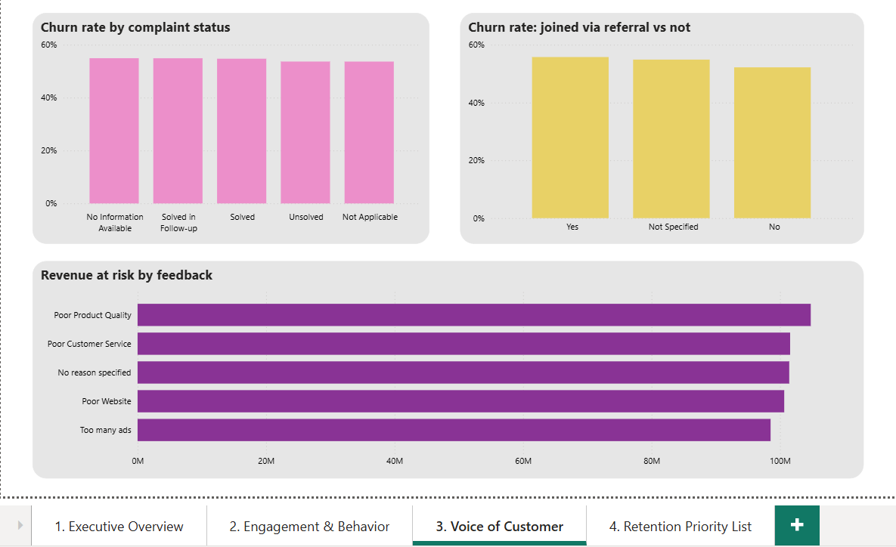
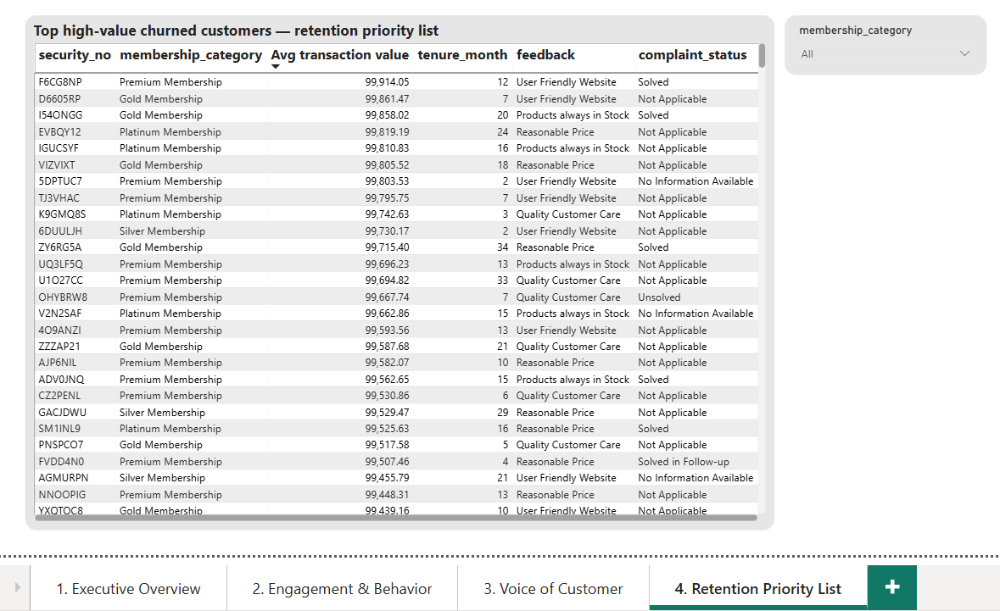

# Customer Churn & Retention Analytics

## Short Description / Purpose
An end-to-end analytics project analyzing customer churn on a subscription e-commerce platform (36,933 customers). The goal was to move beyond simply predicting churn and instead quantify its business impact — identifying which customer segments drive the most revenue loss, and producing a prioritized list of high-value customers for targeted retention action.

> Note: This project uses a public Kaggle dataset and is not tied to any specific real company.

## Tech Stack
- **Python (Pandas)** — data cleaning and ETL
- **SQL (MySQL)** — churn analysis, segmentation, and aggregation queries
- **Power BI** — interactive 4-page dashboard

## Features / Highlights
- Cleaned and transformed 36,933 customer records, resolving real-world data quality issues including placeholder junk values, invalid negative entries, and inconsistent data types
- Engineered business-relevant features not present in the raw data: revenue-at-risk (spend × churn flag), tenure buckets, engagement-level scoring (based on login frequency), and feedback sentiment grouping
- Wrote SQL queries and views analyzing churn across membership tier, engagement level, tenure, complaint history, and customer feedback
- Built a 4-page Power BI dashboard:
  - **Executive Overview** — KPIs (churn rate, revenue at risk, avg. transaction value), churn rate by membership tier
  - **Engagement & Behavior** — churn by tenure bucket, transaction value by engagement level
  - **Voice of Customer** — complaint status vs. churn, feedback reasons, revenue-at-risk by feedback category
  - **Retention Priority List** — filterable table of high-value churned customers for direct action

## Business Impact & Insights
- **54.1% overall churn rate** across the customer base, with **₹506.9M in cumulative revenue at risk** from churned customers
- **Membership tier is the single strongest churn driver**: Basic/No-Membership customers churned at **97%**, compared to **0%** for Premium/Platinum members — pointing to membership upgrades as the primary retention lever, rather than broad, undifferentiated campaigns
- **Engagement correlates with both spend and retention**: highly engaged customers churn less (42% vs. 59% for low-engagement customers) and spend more on average (₹34K vs. ₹27K)
- **No single feedback theme dominates churn** — Poor Product Quality, Poor Customer Service, Poor Website, and Too Many Ads are almost evenly distributed among churned customers, suggesting a broad customer-experience improvement is needed rather than one isolated fix
- Complaint resolution status and referral source showed only weak relationships with churn — a useful "what didn't matter" finding that helped focus the recommendation on membership tier and engagement instead

## Screenshots

